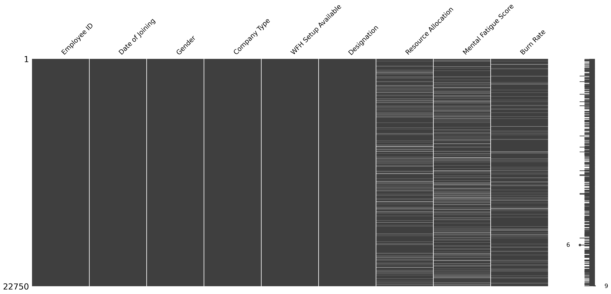
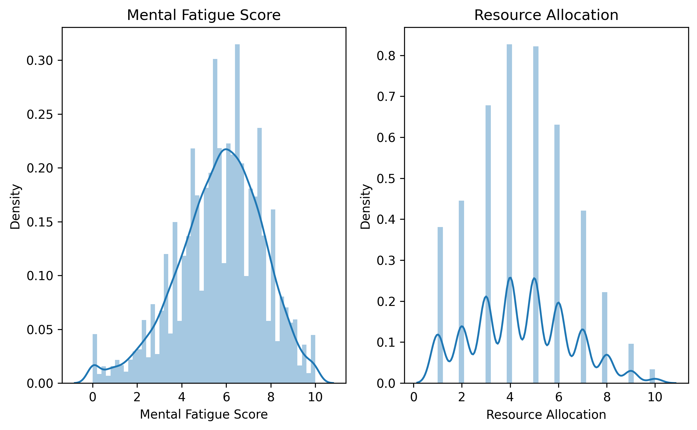
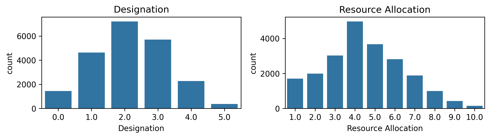
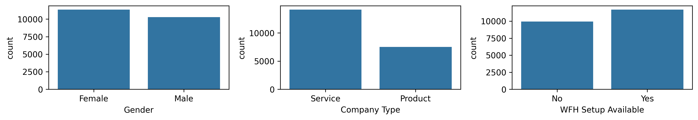

# Employee_BurnRate_Prediction_Model
Predicting employee burnout using data-driven models is essential for proactive intervention, allowing organizations to implement targeted support strategies, foster a healthier work culture, and sustain long-term productivity.This project aims to build and compare the performance of several regression machine learning model to predict employee burnout rate from data such as gender, hours worked per day, designation, and the like.

Table of Contents
## Table of Contents
1. [Problem Statement](#problem-statement)
2. [Data](#data)
3. [Exploratory Data Analysis](#exploratory-data-analysis)
5. [Model Performance](#model-performance)
6. [Model Evaluation](#model-evaluation)
7. [Contributing](#contributing)
8. [Contact Information](#contact-information)

## 1. Problem Statement
Today, burnout is often described as 'The Great Exhaustion' because according to a study published by Mercer in 2024, 8 out of 10 employees are at risk of burnout. It thus comes as no surprise that HR departments are very interested in monitoring their employees' burnout rate. Without early detection, burnout often results in increased absenteeism, higher turnover rates, and a steep rise in recruitment and training costs, ultimately undermining the organization's competitive edge Understanding and predicting employee burnout rates with machine learning can provide organizations with the right insights to create supportive and healthy environments in the workplace as well as sustain long-tern prodductivity.

## 2.Data
The dataset used for this project consists of HR Analytics data including, when an employee joined the company, there level in the company, gender, whether work from home options are available, their mental fatigue score, among other features and the target variable, the burn out rate.

## 3.Exploratory Data Analysis
#### 3.1 Handling missingness
All rows with missing values in the target variable were droped. Missingness in the 'Resource Allocation' and 'Mental Fatigue Score' were imputed using median and mean respectively based on their distributions.

| Missingness in the data  | Data distributions of missing features |
|:--------------:|:--------------:|
|  |  |

#### 3.2 Univariate Analysis
This section will briefly highlight some of the insights learned from univariate analysis
The majority of employees hold mid-senior level positions, indicating a workforce with substantial experience and expertise. Their daily working hours typically range between 4 to 5 hours, suggesting a flexible or results-driven work environment. The short working hours could also suggest that the work is mostly project-based and propably their is an emphasis on quality and not quantity.

The inference that the work environment is flexible is further supported by the fact that majority of employees have work from home setup available for them. There is relatively an equal gender balance, with female employees being slightly more than male employees and majority of the workforce work in the service department.

#### 3.3 Bivariate Analysis
From a correlation analysis we learn that:
-The high your seniority, the more burn out.
-The more hours you work, the higher your burn rate.
-An increase in mental fatigue results in an increase in burn out rate.

## 4. Model Performance

## 5. Evaluation 

## 6. Contributing
1. Fork & clone the repo locally
2. Create a new branch
3. Make changes on your branch
4. Open a pull request and submit your work for review
   
## 7. Contact Information
Please reach me via email at: mwangi25.mercy@gmail.com

